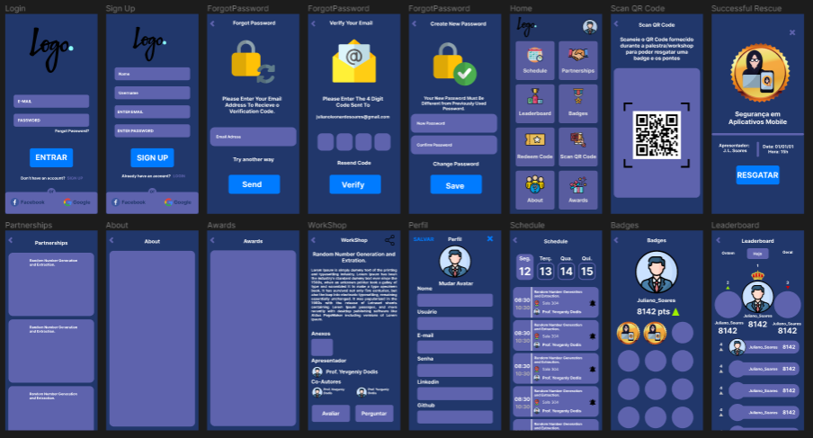

# Backend Para Aplicativo de Gamificação de Eventos

Este projeto tem como objetivo transformar os eventos em games, incentivando as pessoas a se tornarem mais participativas durante o evento com incentivo de pontuações e recompensas por ações que elas fazem. Este projeto terá dois aplicativos, um para os usuários verem suas pontuações e poderem escanear QR Codes durante o evento que lhes darão pontuações caso elas terminem o desafio proposto no QR Code, também poderão fazer perguntas durante as palestras, compartilhar, ser notificado caso um evento ira começar, avaliar as palestras assistidas, escanear QR Codes de outros usuários e poder visualizar suas redes sociais e assim poder se conectar com elas. O outro será um aplicativo gerenciador para as pessoas do grupo de organização do evento para fazer o check-in, e atribuir pontos aos usuários caso necessário, também visualizar a lista de presença e o ranking da gamificação, e sortear prêmios para as pessoas presentes em uma palestra.  

Link do designer feito por mim: [Manager Gamification](https://www.figma.com/file/7t8Hto69dYbK7h5IrumUyv/Gamification-SBSeg?node-id=0%3A1)

### Tabelas:
> User

| Collumn    | Type         |
| ---------- | ------------ |
| id         | uuid         |
| username   | varchar(180) |
| name       | varchar(180) |
| email      | varchar(180) |
| password   | varchar      |
| role       | varchar(20)  |
| phone      | varchar(11)  |
| avatar     | string       |
| bio        | string       |
| location   | string       |
| gender     | string       |
| qrcode     | string       |
| verified   | boolean      |
| linkedin   | varchar(180) |
| github     | varchar(180) |
| created_at | datetime     |
| updated_at | datetime     |
| last_login | datetime     |

> Presença

| Collumn    | Type |
| ---------- | ---- |
| id         | uuid |
| rfk_User   | uuid |
| rfk_event  | uuid |
| created_at | date |

> Scores Daily

| Collumn    | Type   |
| ---------- | ------ |
| id         | uuid   |
| score      | number |
| rfk_User   | uuid   |
| rfk_event  | uuid   |
| created_at | date   |

> Scores Total

| Collumn    | Type   |
| ---------- | ------ |
| id         | uuid   |
| score      | number |
| rfk_User   | uuid   |
| rfk_event  | uuid   |
| created_at | date   |
| updated_at | date   |

> Ativar Notificações

| Collumn    | Type |
| ---------- | ---- |
| Id         | uuid |
| rfk_User   | uuid |
| rfk_event  | uuid |
| created_at | date |

> badge_user

| Collumn    | Type |
| ---------- | ---- |
| Id         | uuid |
| rfk_User   | uuid |
| rfk_event  | uuid |
| rfk_Badge  | uuid |
| created_at | date |

> badge

| Collumn    | Type   |
| ---------- | ------ |
| Id         | uuid   |
| url_bagde  | string |
| rfk_event  | uuid   |
| created_at | date   |
| updated_at | date   |

> Evento

| Collumn     | Type     |
| ----------- | -------- |
| Id          | uuid     |
| title       | string   |
| description | string   |
| start_time  | DateTime |
| end_time    | DateTime |
| QRCode      | varchar  |
| isActive    | bool     |
| rfk_badge   | uuid     |
| created_at  | date     |
| updated_at  | date     |

> Palestrantes

| Collumn    | Type |
| ---------- | ---- |
| Id         | uuid |
| rfk_evento | uuid |
| rfk_user   | uuid |
| type       | uuid |
| created_at | date |

> Anexos

| Collumn    | Type   |
| ---------- | ------ |
| Id         | uuid   |
| rfk_evento | uuid   |
| url_anexo  | string |
| created_at | date   |

> Avaliações

| Collumn    | Type   |
| ---------- | ------ |
| Id         | uuid   |
| rfk_User   | uuid   |
| rfk_event  | uuid   |
| stars      | number |
| message    | number |
| created_at | date   |
| updated_at | date   |

> Token

| Collumn  | Type   |
| -------- | ------ |
| Id       | uuid   |
| rfk_User | uuid   |
| token    | string |

> Refresh Token

| Collumn       | Type   |
| ------------- | ------ |
| Id            | uuid   |
| rfk_User      | uuid   |
| refresh_token | string |

### API
> Usuário/Participante
  - [X] Cadastrar Perfil - Rota POST = /user
  - [X] Remover Perfil - Rota DELETE = /user/:id
  - [X] Visualizar seu Perfil - Rota GET = /user/:id
  - [X] Listar Todos Perfils - Rota GET = /user
  - [X] Buscar por username - 
  - [X] Buscar por e-mail
  - [ ] Recuperação de senha
  - [ ] Verificação de e-mail
  - [ ] Editar Perfil - Rota PUT = /user/:id
  - [ ] Editar somente o Avatar - Rota PUT = /user/:id 
  - [ ] Adicionar Notificacoes
  - [ ] Listar Notificacoes ativas
  - [ ] Remove suas Notificações
  - [ ] ver sua pontuação
  - [ ] Ver sua classificação
  - [ ] ver perfil de outras pessoas
  - [ ] Seguir pessoas segui-las
  - [ ] Gerar minhas presenças
> Administrador
  - [ ] Login
  - [ ] Listar palestras - Ativas, Desativadas
  - [ ] Buscar informações Palestra
  - [ ] Listar presenças
  - [ ] Gerar certificados
  - [ ] Gerar lista de presença no evento
  - [ ] Gerar lista de presença por palestra
  - [ ] Imprimir crachás
  - [ ] Inserir vários usuários a partir de um excel
> Palestrante/Apresentador
  - [ ] Cadastrar/Editar/Remover sua palestra
  - [ ] Adicionar e remover anexos
  - [ ] Adicionar e remover co-autores
  - [ ] Adicionar e remover redes sociais
> Notificações
  - [ ] Vai rodar um cron a cada 48h para remover do banco notificações já expiradas
> Geral
  - [ ] Login - Rota POST = /login

Tipos de Pontuação
> Presença de chegada no evento geral = +50
> Presença em sessões técnicas, minicursos, workshops e palestras = +20
> Perguntas durante uma sessões técnica, minicurso, workshop e palestra = +50
> Conexões no Linkedin/Redes Sociais = +20
> Avaliações das sessões = +20
> Fazer perguntas = +20

## Mobile

https://www.figma.com/file/7t8Hto69dYbK7h5IrumUyv/Gamification-SBSeg?node-id=125%3A777&t=Aj6OeB6aemKUwf0J-0

### Futuras correcoes

Diminuir o tempo de reset password
- Reset Password - reset_password_expires_in

### Futuras implementacoes

CronJob para remover usuarios criados que nao tiveram sido verificados apos 24h de criacao

[ ] Visualizar eventos
[ ] Visualizar detalhes de eventos
[ ] Comprar incresso de evento
[ ] Meus eventos cadastrados
[ ] Acessar algum avento que estou cadastrado